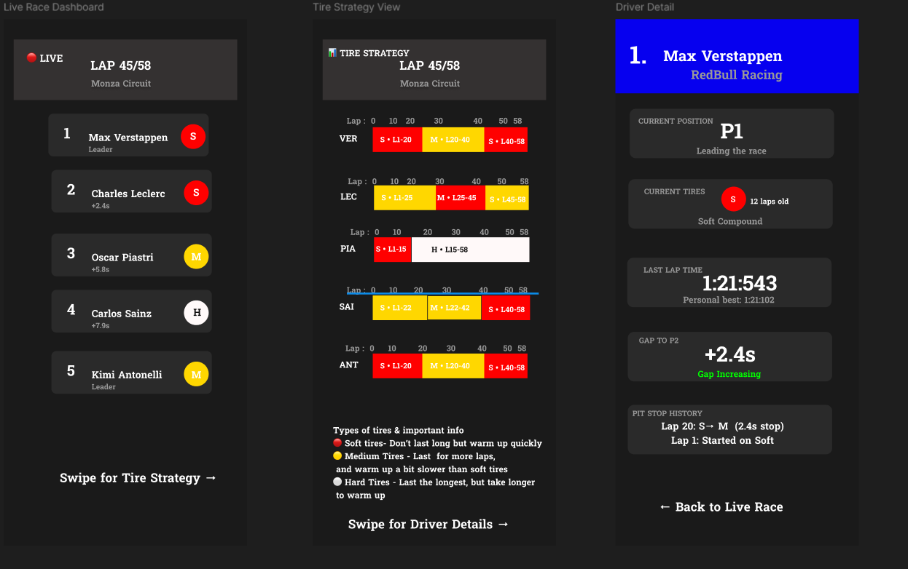
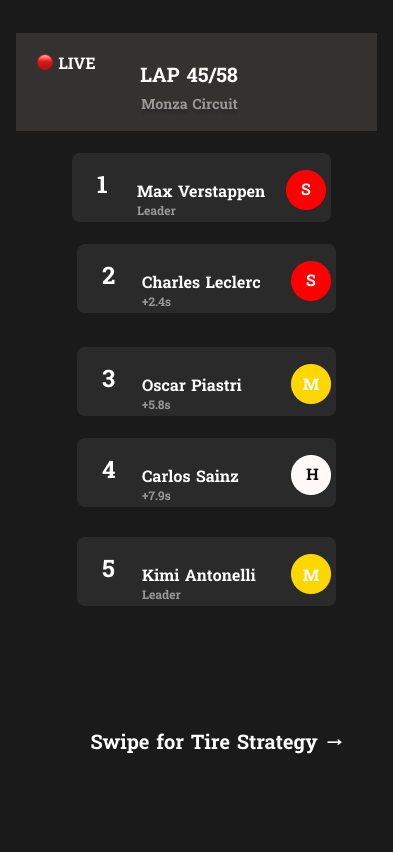
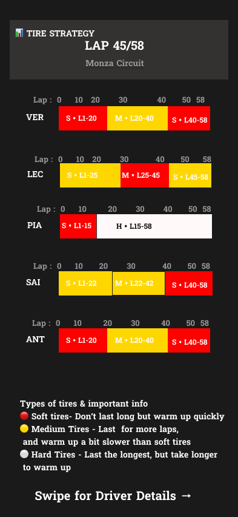
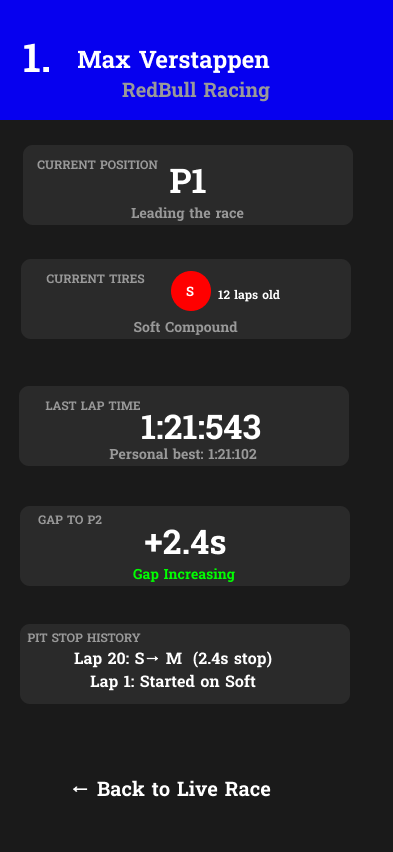

# f1-ux-portfolio
> A streamlined mobile companion for F1 fans providing real-time race data, tire strategy visualization, and driver details—without ads or paywalls.

## 📋 Project Overview

**Role:** UX/UI Designer   
**Tools:** Figma

### The Problem

F1 fans struggle to follow live races and understand complex strategies due to:
- Cluttered interfaces with excessive information
- Constant pop-up ads during critical moments
- Paywalls blocking real-time data access
- Scattered, hard-to-visualize tire strategy information

## 🎯 Solution

A clean, ad-free second-screen experience with three focused views that prioritize the data fans actually need during races.

## 🔍 Design Process

### Research & User Needs

**Target Users:**
- F1 fans watching races on TV seeking a second-screen companion
- Fans without streaming subscriptions needing real-time updates
- New fans learning race strategy and terminology

**Key Insights:**
- Users need tire strategy information at a glance
- Quick access to driver gaps is critical
- Visual representation beats text-heavy data
- No tolerance for ads during race moments

### Information Architecture

Three main screens, each serving a specific purpose:
1. **Live Race Dashboard** - Real-time positions and tire data
2. **Tire Strategy View** - Visual timeline of pit stops and compounds
3. **Driver Detail** - Deep dive into individual statistics

## 🎨 Key Design Decisions

### Dark Theme
Implemented `#1A1A1A` background to reduce eye strain during long viewing sessions and improve contrast for critical data.

### Color-Coded Tire System
- 🔴 Red = Soft compound
- 🟡 Yellow = Medium compound  
- ⚪ White = Hard compound

Mirrors F1's official system for instant recognition.

### Visual Tire Timeline
Horizontal timeline bars show pit stop timing and compound choices, enabling quick strategy comparisons across drivers.

### Minimal Text, Maximum Information
Each data point includes clear labels, large readable numbers, and supporting context (e.g., "12 laps old").

## 📱 Final Designs

### Live Race Dashboard

**Features:**
- Scrollable driver position list with real-time gaps
- Color-coded tire indicators for each driver
- Race status (lap counter, circuit)
- Swipe hint for navigation

**Why it works:** Prioritizes the most frequently checked information with instant visual tire compound recognition.

---

### Tire Strategy View

**Features:**
- Visual timeline for each driver's pit strategy
- Color-coded stint blocks with lap ranges
- Educational tire compound information
- Easy-to-read lap scale markers

**Why it works:** Complex strategy becomes instantly understandable. Users can see at a glance that Verstappen used a three-stop strategy while Piastri attempted a one-stopper.

---

### Driver Detail

**Features:**
- Team-colored header with driver info
- Current position and tire data
- Last lap time vs. personal best
- Gap trends with visual indicators
- Complete pit stop history

**Why it works:** All relevant driver information consolidated in one view with clear visual hierarchy.

## 💡 What I Learned

**Visual Data > Text Lists**  
The tire strategy timeline became the app's strongest feature. Visual representation made complex data exponentially clearer than text alternatives.

**Context-Driven Design**  
F1 races are fast-paced—users need instant information with minimal navigation. Every decision prioritized speed and clarity.

**Color as Communication**  
Using F1's official tire colors made the interface intuitive for existing fans while educating newcomers.

**Solving Real Problems**  
Designing from personal frustration with existing apps kept me focused on actual user needs over unnecessary features.

## 🚀 Next Steps

Future improvements would include:
- Live timing data with sector splits
- Weather conditions and track temperature
- Push notifications for key events (pit stops, safety cars, retirements)
- Historical race data and statistics
- Dark/light mode toggle
- Tablet version with split-screen capabilities

## 📄 Full Case Study

[View complete case study PDF](docs/F1-Race-Companion-Case-Study.pdf)

---

**Contact:** palazzo.g@northeastern.edu  
